# 霞襲 ビルドガイド

<!-- TOC -->

- [霞襲 ビルドガイド](#霞襲-ビルドガイド)
    - [必要なパーツ](#必要なパーツ)
    - [使用する道具、消耗品](#使用する道具消耗品)
    - [ビルドガイド](#ビルドガイド)
        - [Pro Microのもげ防止加工](#pro-microのもげ防止加工)
        - [基板のカット](#基板のカット)
        - [基板側面のヤスリがけ（お好みで）](#基板側面のヤスリがけお好みで)
        - [はんだ付けのイメージトレーニング](#はんだ付けのイメージトレーニング)
        - [土台の組み立て](#土台の組み立て)
        - [Pro Microの取り付け](#pro-microの取り付け)
        - [ダイオードの取り付け](#ダイオードの取り付け)
        - [キースイッチの取り付け](#キースイッチの取り付け)
        - [枠の組み立て](#枠の組み立て)
        - [Pro Microの再取り付け](#pro-microの再取り付け)
        - [キーキャップの取り付け](#キーキャップの取り付け)
        - [ゴム足の取り付け](#ゴム足の取り付け)
        - [ファームウェアの書き込み](#ファームウェアの書き込み)
        - [オプション:バックライト用LEDの取り付け](#オプションバックライト用ledの取り付け)
    - [トラブルシューティング](#トラブルシューティング)

<!-- /TOC -->

## 必要なパーツ

[霞襲 パーツリスト](bom_list_jp.md)をご覧ください。

## 使用する道具、消耗品

[使用する道具、消耗品](tool_guide_jp.md)におすすめの道具類、注意事項等をまとめましたのでご覧ください。

## ビルドガイド

### Pro Microのもげ防止加工

Pro Microにエポキシ接着剤を盛って、簡単にはもげないようにします。

参考1:[ProMicroのモゲ防止ついでにQMK_Firmwareを書き込む - Qiita](https://qiita.com/hdbx/items/2f3e4ddfcadda2a5578e)
参考2:[もげ予防 - Self-Made Keyboards in Japan](https://scrapbox.io/self-made-kbds-ja/%E3%82%82%E3%81%92%E4%BA%88%E9%98%B2)

エポキシ接着剤の2液を混ぜます。


接着剤を付け始める前にMicro USBコネクタを横から見てください。側面に穴が開いています。この穴に接着剤が入ると端子が入らなくなったり、入りにくくなったりします。


この穴を避けて、つまようじなどで接着剤を盛っていきます。


乾くまで置いておきます。

### 基板のカット

基板の細い部分をニッパーで切断し、各パーツに分けます。パーツや欠片が飛びますので、袋に入れながら行うなど、注意してカットしてください。


### 基板側面のヤスリがけ（お好みで）

基板の側面のバリをヤスリで整えます、紙ヤスリの場合、机の角に置き、その上でヤスリがけします。

### はんだ付けのイメージトレーニング

はんだ付けに慣れている方は次の項に進んでください。

全くはんだ付けをしたことがなかったり、数年ぶりにはんだ付けをする場合は、以下の動画が参考になります。

- [はんだ付けの詳細.m2p - YouTube](https://www.youtube.com/watch?v=ZA-ehWjRfYM)

- [基礎からわかる！自キ入門講座 第8回「自作キーボードのつくりかた #2」 - YouTube](https://www.youtube.com/watch?v=LOC53FeU-QM&t=999)

### 土台の組み立て

下の図のとおり重ねたいので、以下の指示に従って上側から逆向きに重ねていきます。


まずはD1～D4を下の写真のとおり並べます。
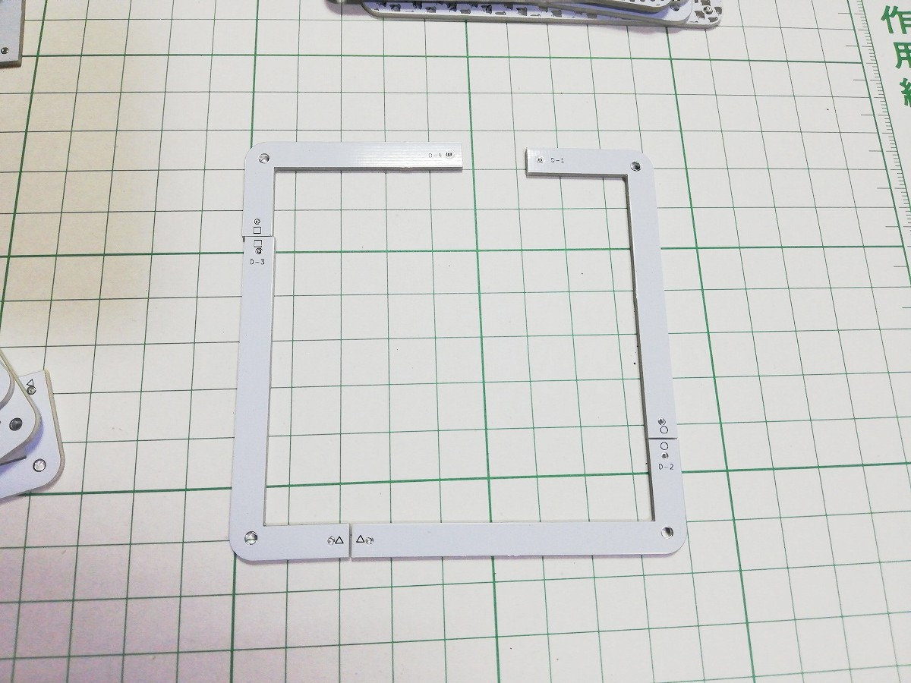

その上にC1～C4を並べます。
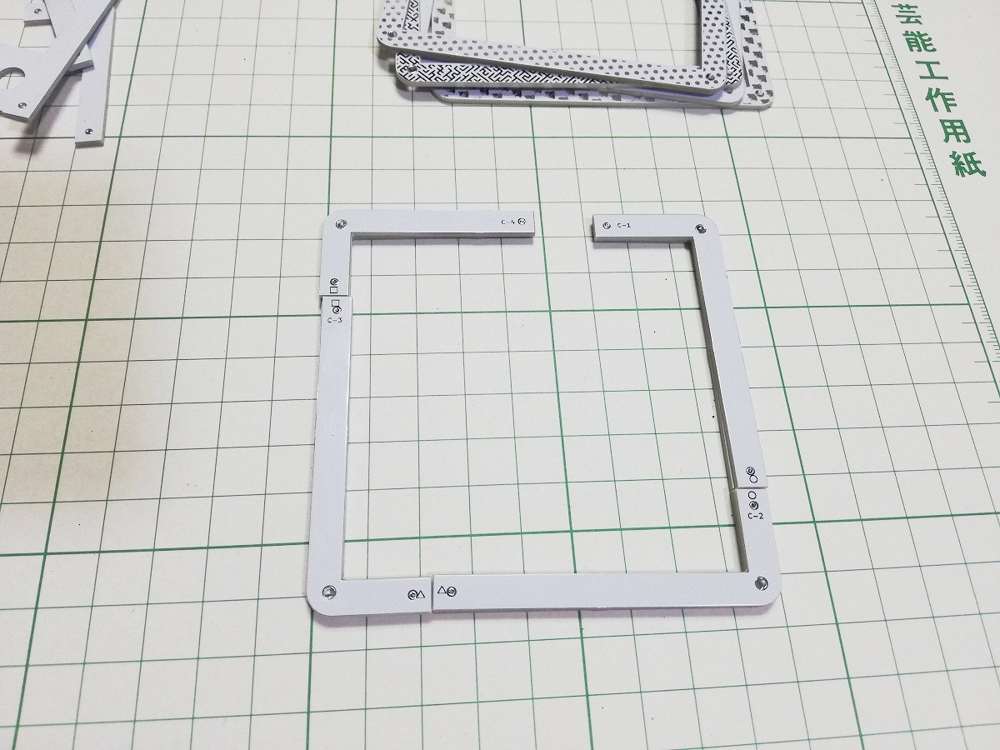

その上に基板を置きます。


その上にA1～A4を並べます。
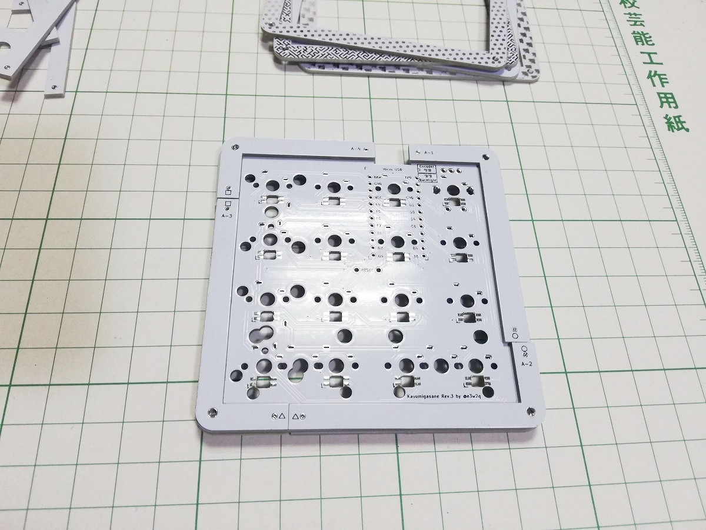

その上に何も書かれていない土台パーツを下の写真のとおり並べます。


Pro Micro付属のピンヘッダを1本カットし、プラスチック部分を片側にずらします。
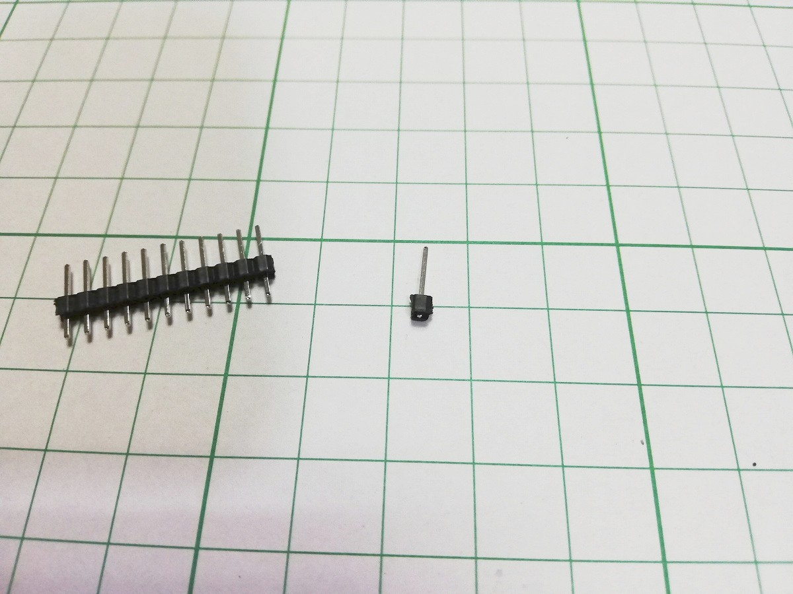

ニッパーで、プラスチック部分のキワでカットします。針金部分を使うので、飛ばないように注意してカットしてください。


カットしたピンを、先ほど重ねた土台パーツの小さい穴に差し込み、一番下まで通します。


裏面からはんだ付けします。基板が浮かないように、押し付けながら行ってください。
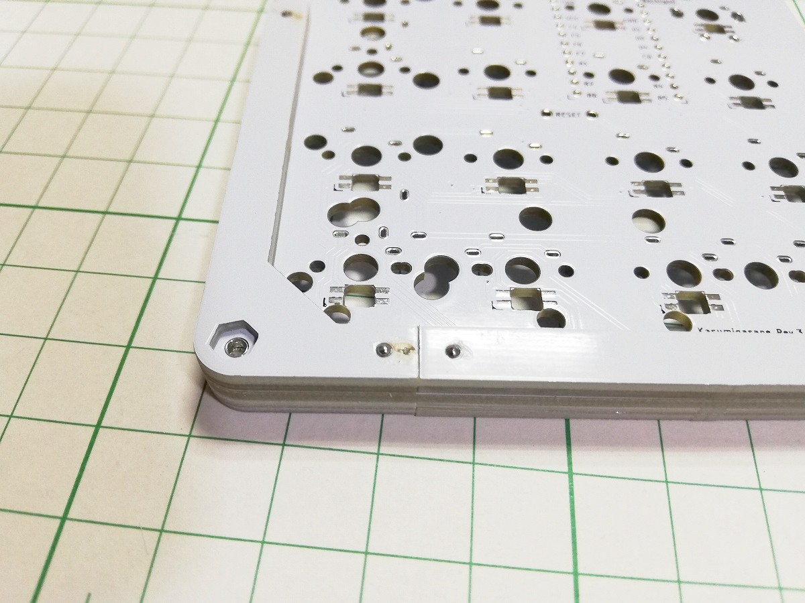

裏返して表面からはんだ付けします。半田が盛り上がると上から枠パーツを重ねたときに隙間ができてしまうので、盛り上がらない程度に半田を流し込んでください。もし半田を入れすぎたら、吸い取り線で吸って減らしてください。


これで土台までできました。


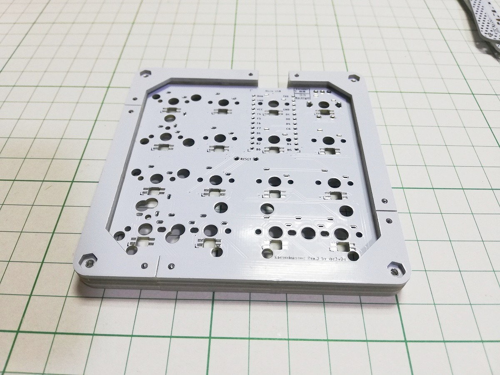

ピンを表側にはみ出さないようにし、裏側からピンをはんだ付けします。出っ張りができてしまうので、表側からははんだ付けしません。

### Pro Microの取り付け

**基板裏側**のPro Micro設置部分のスルーホールに、コンスルーピンヘッダを根本まで差し込みます。

その際、

- コンスルーピンヘッダの金色の窓が遠い側を基板側とし、金色の窓が近い側をProMicro側とする
- 金色の窓の向きを揃える

ようにしてください。

参考: [Helixベータ ビルドガイド](https://github.com/MakotoKurauchi/helix/blob/master/Doc/buildguide_jp.md#pro-micro)


ピンヘッダにPro Microを差し込みます。**Pro Microの裏面（平らなほう）が上になるように、またマイクロUSBが基板端になるように**します。

**向きを間違えるとリカバリーが大変です。表裏、左右をよく確認してください。**


Pro Microとコンスルーピンヘッダをハンダ付けします。まず四隅をハンダ付けし、横から見てコンスルーピンヘッダとの間に隙間があれば押さえながらハンダを温めて浮かないようにします。そのあと、順番に全てハンダ付けします。
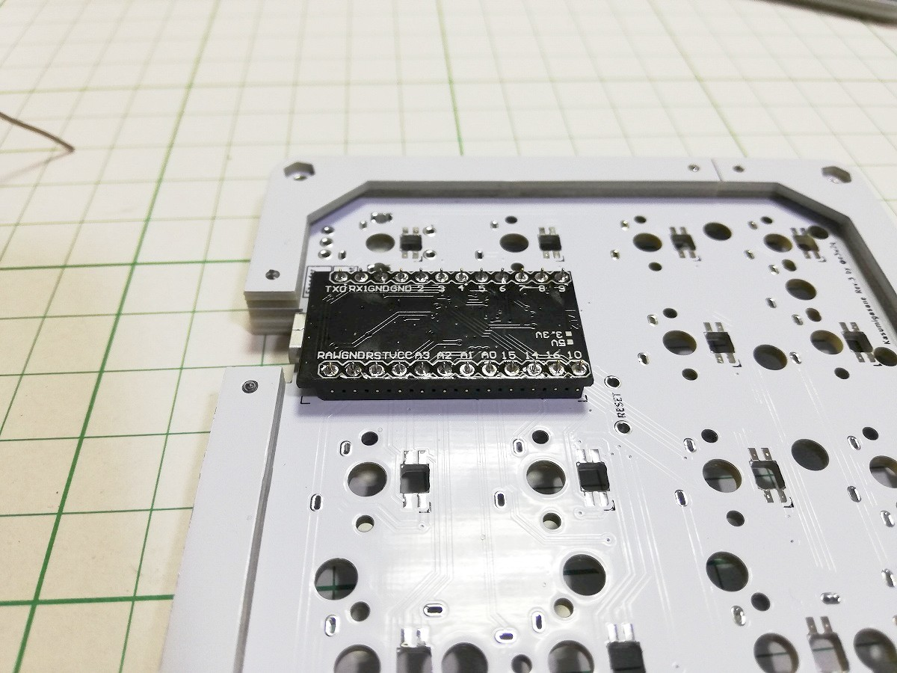

基板とコンスルーピンヘッダは接触しているため、ハンダ付けしません。

次項のキースイッチの取り付けを行う前に、一度Pro Microを基板から外します。

### ダイオードの取り付け

このキーパッドはキーマトリクスを使わず、各キーがGPIOのピンに接続しているため、ダイオードのはんだ付けは不要です。

### キースイッチの取り付け

表側から差し込みます。トッププレート無しでもキースイッチのガタつきがないよう、穴のサイズを小さめにしてあります。ギュッと押し込んでください。キースイッチの足が曲がっている場合はまっすぐにしてから差し込んでください。

**Pro Microが取り付けられる部分のスイッチ2個は、差し込む前に端子をカットし、基板からはみ出さないようにしてください**

全部のキースイッチを差し込み終わったら、サイド方向からよく見て、スイッチが傾いていないか確認してください。


裏面もサイド方向からよく見て、キースイッチの固定用のピンの長さがどのキーも同じぐらい出ているか確認してください。


### 枠の組み立て

お好みの図柄が一番上になるようにして、枠パーツ4枚を表側に重ねます。
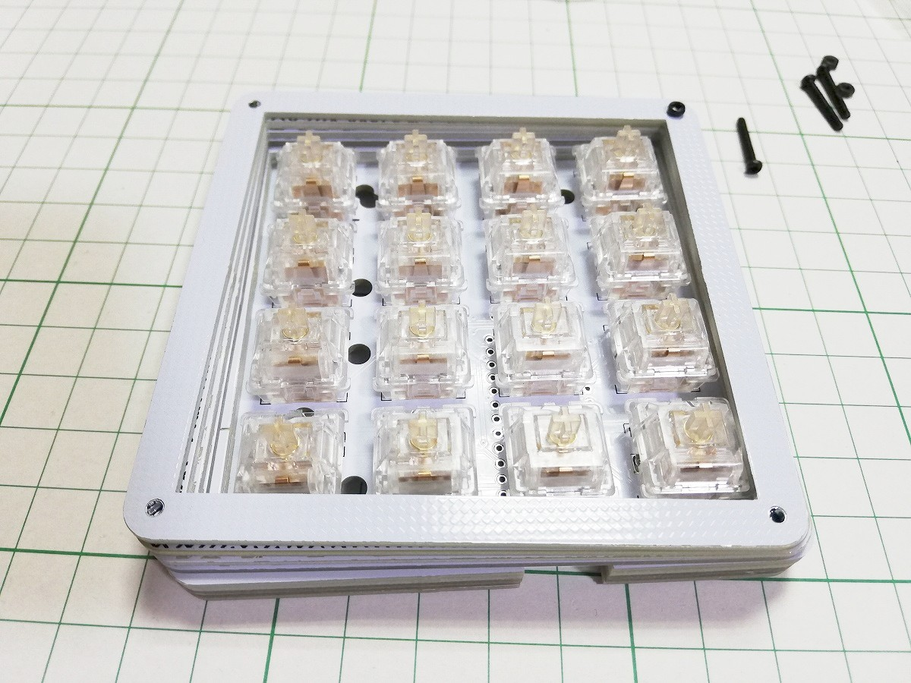

表からM2ネジ、裏にM2ナットを入れて固定します。
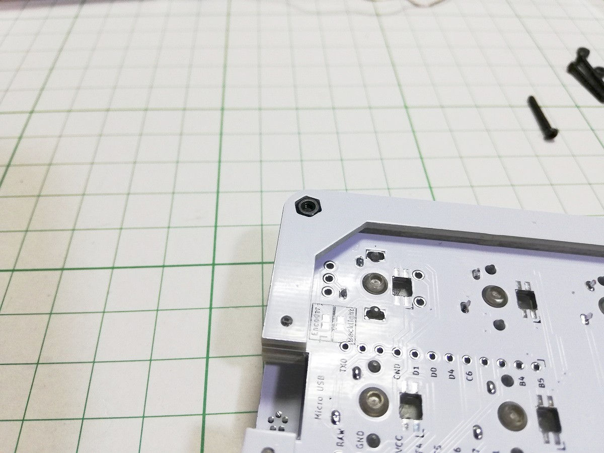

端面をやすりで磨くと段差が無くなります。

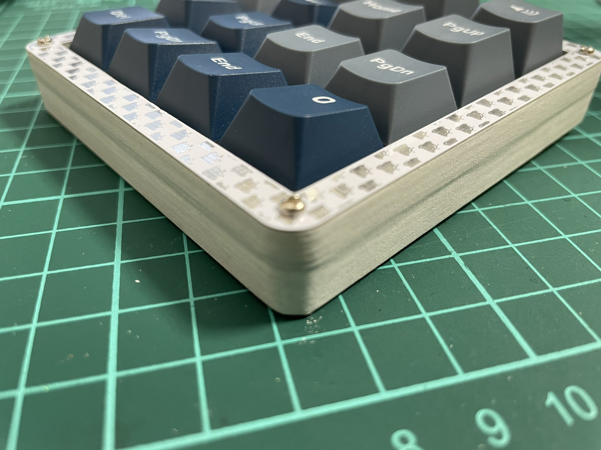

お好みで、ガンダムマーカーやポスカで塗ったり、好きな柄のマスキングテープで囲んでみてもよいです。

### Pro Microの再取り付け

裏からPro Microを再度取り付けます。
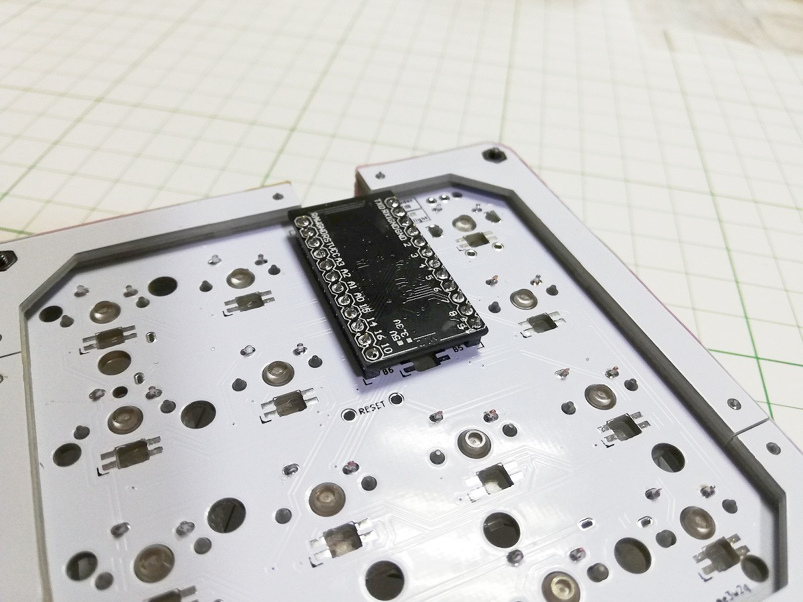

### キーキャップの取り付け

キースイッチにキーキャップをはめます。


### ゴム足の取り付け

ゴム足を裏面の四隅に取り付けます。

### ファームウェアの書き込み

以下のリンク先を参考にして、QMK Firmwareのビルド環境を用意します。

- Windows
  - [QMKビルド環境の構築(Windows Msys2編)](https://gist.github.com/e3w2q/4bc86e531d1c893d3d13af3e9895a94a)
- macOS
  - [セットアップ - QMK Firmware](https://docs.qmk.fm/#/ja/newbs_getting_started?id=macos)
- Linux
  - [セットアップ - QMK Firmware](https://docs.qmk.fm/#/ja/newbs_getting_started?id=linux)

構築中、

```
qmk setup
```

と入力する代わりに

```
qmk setup e3w2q/qmk_firmware --branch e3w2q
```

と入力してください。

または、`qmk setup`した後に、`C:\Users\USER_NAME\qmk_firmware\keyboards`配下に[https://github.com/e3w2q/qmk_firmware/tree/e3w2q/keyboards/e3w2q](https://github.com/e3w2q/qmk_firmware/tree/e3w2q/keyboards/e3w2q)以下をコピーしてもよいです。

用意されたキーマップを書き込むには以下を実行します。

```
qmk flash -kb e3w2q/kasumigasane -km default
```

`Detecting USB port, reset your controller now...`と表示されたら裏面中央のRESETと書かれたところの左右の穴をピンセットやクリップなどで短絡させると書き込みが始まります。

[QMK Configuratorのテストモード](https://config.qmk.fm/#/test)でキー入力が行えるかテストしてください。

### オプション:バックライト用LEDの取り付け

基板を裏返し、Pro Microを外し、各スイッチにタブ付きのRGBLEDをはんだ付けします。基板の裏側から見たときに、LEDは裏側が見えるようにし、LEDのタブの欠けがシルクのL字と一致するように付けます。

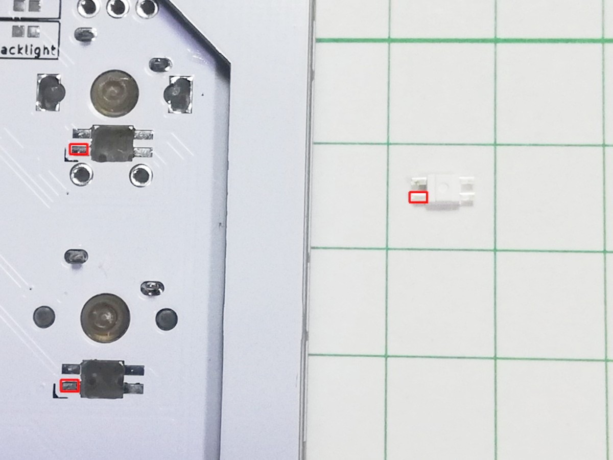

Backlightと書かれたジャンパをハンダで導通させます。

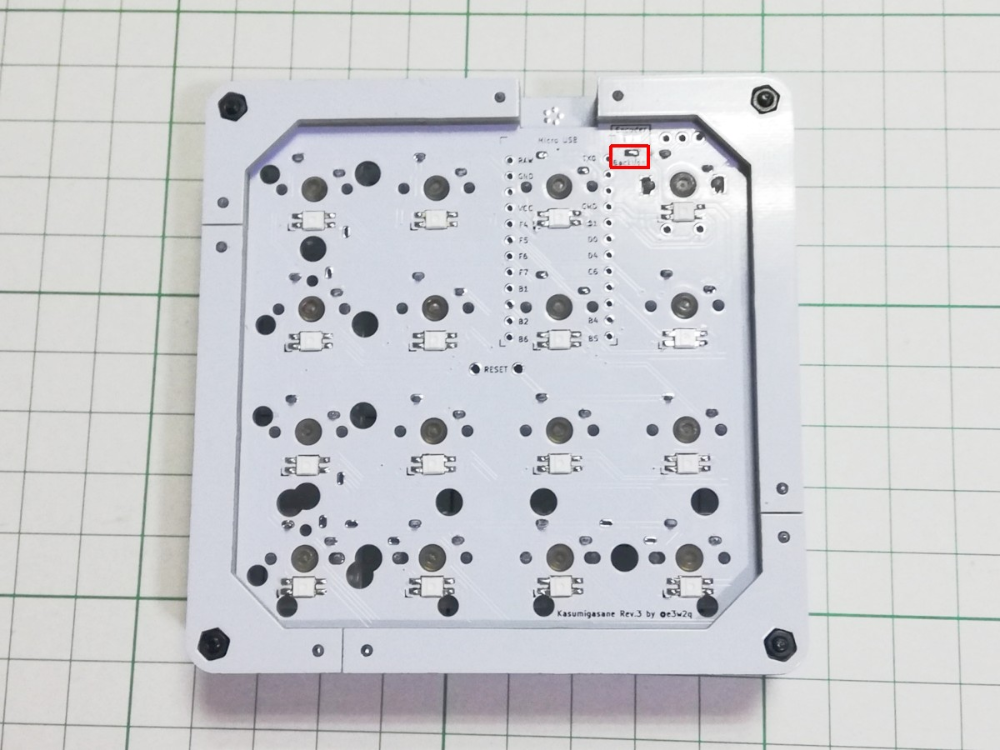

## トラブルシューティング

- 特定のキーが反応しない
  - キースイッチのハンダ付けが甘い場合があります。キースイッチを押すかわりに、キースイッチの裏面のハンダ2箇所をピンセットでショートさせてみて、入力されるか確認してください。入力される場合は、ハンダ付けし直してみてください。
